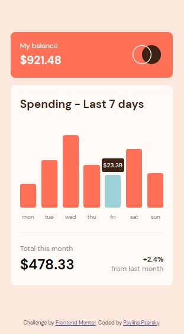

# Frontend Mentor - Expenses chart component solution

This is a solution to the [Expenses chart component challenge on Frontend Mentor](https://www.frontendmentor.io/challenges/expenses-chart-component-e7yJBUdjwt). Frontend Mentor challenges help you improve your coding skills by building realistic projects. 

## Table of contents

- [Overview](#overview)
  - [The challenge](#the-challenge)
  - [Screenshot](#screenshot)
  - [Links](#links)
- [My process](#my-process)
  - [Built with](#built-with)
  - [What I learned](#what-i-learned)
  - [Continued development](#continued-development)
  - [Useful resources](#useful-resources)
- [Author](#author)
- [Acknowledgments](#acknowledgments)

## Overview

### The challenge

Users should be able to:

- View the bar chart and hover over the individual bars to see the correct amounts for each day
- See the current day’s bar highlighted in a different colour to the other bars
- View the optimal layout for the content depending on their device’s screen size
- See hover states for all interactive elements on the page
- **Bonus**: Use the JSON data file provided to dynamically size the bars on the chart

### Screenshot

| Desktop layout |
|:--:|
 

| Mobile layout |
|:--:|
 

### Links

- Solution URL: https://github.com/PavlinaPs/react-expenses-chart-component
- Live Site URL: https://pavlinaps.github.io/react-expenses-chart-component

## My process

### Built with

- Semantic HTML5 markup
- CSS custom properties
- Flexbox
- CSS Grid
- Mobile-first workflow
- [React](https://reactjs.org/) - JS library


### What I learned

Another great challenge, I chose to solve it with the bonus. For the record, the day of submitting was a Friday.

- ##### Get current day of week
I needed to render the chart bar background color based on two conditions - day of week and hover. There most likely is a less verbose way. This is what I came up with:
```jsx
  let today = new Date();
  let todayIs = today.getDay();
  // returns a number, 4 for Thursday
  let days = data.map(item => item.day);
  let dayOfWeek = days[todayIs - 1];
  // -1 to compensate for the 0 indexing
```

- ##### Rendering background color
I created a variable expenseBgColor. Again, it is a little verbose but it works fine:

```jsx
  let expenseBgColor = {backgroundColor: "hsl(10, 79%, 65%)"};
  if (dayOfWeek === day) {
    expenseBgColor = {backgroundColor: "hsl(186, 34%, 60%)"};
  }
  if (hovered) {
    expenseBgColor = {backgroundColor: "hsl(10, 79%, 75%)"};
  } 
  if (dayOfWeek === day && hovered) {
    expenseBgColor = {backgroundColor: "hsl(186, 34%, 75%)"}
  }
```
- ##### Hover/focus states
I set the hover/focus as a state based on onMouseEnter/onMouseLeave and onFocus/onBlur and then rendered the amounts' visibility according to it. 
```jsx
<div className="Expenses__chart--hover"
  style={{visibility: hovered ? 'visible' : 'hidden'}}
>${amount}</div>
```

- ##### Accessibility
I added aria labels for corresponding bars otherwise showing only on hover/focus. The screen reader reads the amounts right away. I checked. Hope I won't get the possible misuse warning again!
I also added a tabindex to the bars, the bars are "tabable".
```jsx
<div 
  className="Expenses__chart--field"
  onMouseEnter={() => setHovered(true)}
  onMouseLeave={() => setHovered(false)}
  onFocus={() => setHovered(true)}
  onBlur={() => setHovered(false)}
  style={{ ...expenseBgColor, ...fieldHeight }}
  aria-label={amount}
  tabIndex="0"
></div>
```

### Continued development

After submitting this challenge I would like to check others' solution for less verbose ways. And proper way of accessibility.


### Useful resources

- [How to Combine Multiple Inline Style Objects in React?](https://thewebdev.info/2021/05/27/how-to-combine-multiple-inline-style-objects-in-react/)
- [React JSX - Setting a dynamic :hover color pseudo-class property](https://stackoverflow.com/questions/71249961/react-jsx-setting-a-dynamic-hover-color-pseudoclass-property)
- [What is the React.js way of handling visibility=hidden?](https://stackoverflow.com/questions/33667773/what-is-the-react-js-way-of-handling-visibility-hidden)
- [Change value in react js on window resize](https://stackoverflow.com/questions/52037958/change-value-in-react-js-on-window-resize)
- [How to get the day of week and the month of the year?](https://stackoverflow.com/questions/4822852/how-to-get-the-day-of-week-and-the-month-of-the-year)
- [Opposite of 'onFocus' in React](https://stackoverflow.com/questions/37542422/opposite-of-onfocus-in-react)

## Author

- GitHub - [PavlinaPs](https://github.com/PavlinaPs)
- Frontend Mentor - [@PavlinaPs](https://www.frontendmentor.io/profile/PavlinaPs)

## Acknowledgments

It is great that I can solve Frontend Mentor's challenges. They are all very useful for me. Every single one. Thank you!
